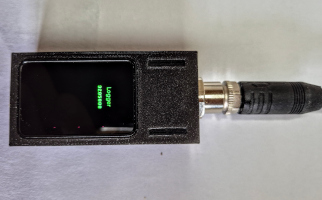

# ESP32 CAN Logger for CANaerospace with WiFi File Browser

This project implements a **dual-mode ESP32 application** for capturing and storing CAN bus data onto an SD card,
while also providing a temporary WiFi access point with a web-based file browser to retrieve logged data.


---

## Features

### WiFi File Browser
- **WiFi SoftAP Setup** with WPA/WPA2 authentication.
- **Dynamic SSID Generation** based on ESP32 MAC address.
- **Web-based File Browser**:
    - Displays SD card files in a clean HTML table.
    - Supports file size display in human-readable format (KB, MB, GB).
    - Click-to-download functionality with MIME type detection.
- **Automatic Session Timeout**
    - Tracks last HTTP activity.
    - Shuts down after configurable inactivity time.
- **SD Card Handling**
    - SPI interface with 25 MHz clock.
    - Safe mount/unmount before and after WiFi phase.

---

### CAN Logging System
- **CAN Bus Support (TWAI Driver)**
    - Configured for **500 kbit/s**.
    - Accepts all CAN frames.
    - Reliable driver startup with retry on failure.
- **SD Card Logging**
    - Files named sequentially as `CANxxxxx.LOG`.
    - Automatic **old file cleanup** if free space < 1 GB (reclaims up to 2 GB).
    - Efficient batch writes with **32 KB buffering**.
    - Uses `fsync()` to ensure data integrity.
- **Logging Format**
    - Each CAN frame stored as:
      ```
      (timestamp) can <ID>#<DATA>
      ```  
      Example:
      ```
      (1755839938.123456) can 123#11AAFF
      ```
- **Task-based Architecture**
    - `CAN_RX Task`: Receives frames from TWAI driver.
    - `CAN_Proc Task`: Formats messages into log lines.
    - `SD_Writer Task`: Buffers and writes batches to SD card.
- **Runtime Monitoring**
    - Tracks total message count.
    - Periodic logging of statistics to console.

---

## Technical Highlights
- **FreeRTOS Queues** for decoupled CAN reception and SD writing.
- **High-throughput SD logging** using buffered I/O.
- **Failsafe Storage Management** with automatic cleanup.
- **Lightweight Web Server** (ESP-IDF HTTPD) for SD browsing and downloads.
- **No RTC dependency**: Uses a fictional start timestamp to emulate Unix t.ime.
- **Tested on a ESP32-S3 board** ([ESP32-S3 1.64inch AMOLED Touch Display Development Board](https://www.waveshare.com/esp32-s3-touch-amoled-1.64.htm) and
  [ESP32-S3-Touch-AMOLED-1.75](https://www.waveshare.com/wiki/ESP32-S3-Touch-AMOLED-1.75)) with a SANDISK High Endurance
  32 GB, microSDHC.
- **Performance Test**: Running `cangen can0 -D i -I i -L 4 -g 0.7` resulted in a transmission rate of approximately 1,200 messages per second.
---

## Typical Use Case
1. **Power up device** → ESP32 starts in **WiFi AP mode** with SD card accessible via browser.
2. **Download / inspect past CAN logs** through the web interface.
3. **After inactivity timeout** → Device switches into **logging mode**, continuously recording
4. CAN traffic onto the SD card.

---
## Simple System Diagram

[ ESP32 ]
│
├── WiFi Access Point → Web Browser (PC/Smartphone)
│
├── SPI Interface → SD Card (stores CAN logs)
│
└── CAN TX/RX → CAN Transceiver → CAN Bus (CANH / CANL)


## Pin-to-Pin Wiring Table

| ESP32 Pin | Function       | Connected To                | Notes                        |
|-----------|----------------|-----------------------------|------------------------------|
| GPIO1     | SPI MOSI       | SD Card MOSI                | Data out from ESP32 → SD     |
| GPIO3     | SPI MISO       | SD Card MISO                | Data in from SD → ESP32      |
| GPIO2     | SPI SCLK       | SD Card SCLK                | SPI clock                    |
| GPIO41    | SPI CS         | SD Card CS                  | Chip select                  |
| GPIO9     | CS             | LCD Chip Select             | Active low                   |
| GPIO10    | PCLK           | LCD SPI Clock / Pixel Clock | QSPI clock                   |
| GPIO11    | DATA0          | LCD Data 0 (D0)             | QSPI data line               |
| GPIO12    | DATA1          | LCD Data 1 (D1)             | QSPI data line               |
| GPIO13    | DATA2          | LCD Data 2 (D2)             | QSPI data line               |
| GPIO14    | DATA3          | LCD Data 3 (D3)             | QSPI data line               |
| GPIO21    | RST            | LCD Reset                   | Optional, active low         
| GPIO18    | CAN TX         | CAN Transceiver TXD         | Transmit to CAN bus          |
| GPIO17    | CAN RX         | CAN Transceiver RXD         | Receive from CAN bus         |
| 3V3       | Power          | SD Card VCC, CAN VCC        | Ensure 3.3V compatible       |
| GND       | Ground         | SD Card GND, CAN GND        | Common ground reference      |
| CANH/—    | —              | CAN Bus High Line           | Differential bus line        |
| CANL/—    | —              | CAN Bus Low Line            | Differential bus line        |

## Recommended Parts List (BOM)

### Core Components
- **ESP32 Development Board**
  - Example: ESP32-DevKitC, ESP32-WROOM, or M5Stack Core (if display/UI desired)
  - Must expose SPI pins and GPIOs used in the project

- **SD Card Module (SPI interface)**
  - Example: MicroSD Card Module (3.3V logic, SPI mode support)
  - Ensure 3.3V compatible (no 5V modules without level shifting)
  - MicroSD card, Class 10 or higher, ≥16 GB recommended

- **CAN Transceiver** (connects ESP32 to CAN bus)
  - Example ICs:
    - SN65HVD230 (3.3V, commonly used with ESP32)
    - MCP2551 (5V, requires level shifting for ESP32)
    - TJA1050 (5V, also requires level shifting)
  - Choose based on bus voltage (3.3V-friendly parts are easier)

### Power & Connectivity
- **Stable 5V Supply** (for ESP32 board)
  - ESP32 boards usually regulate down to 3.3V internally
- **Common Ground Reference** between ESP32, SD card, and CAN transceiver
- **CAN Bus Wiring**
  - Twisted pair cable (for CANH & CANL)
  - 120 Ω termination resistors at both bus ends

### Optional / Helpful
- **MicroSD Card Reader** (for PC, to inspect logs directly if needed)
- **USB-to-CAN Adapter** (for testing/logging against a PC CAN interface)
- **Case/Enclosure** to protect the ESP32 + modules in automotive environment
- **For CANaerospace logs**: use [this program](https://github.com/ubx/canlog-correct-ts/blob/master/correct-ts.py) to adjust timestamps.


## Todo
- bigger usb-c excerpt
- bom, 2st. M2x5 Rund, 1st. M3x5 Senk.
- Optional: removable SD card (in lid)
- Optional: PCB

