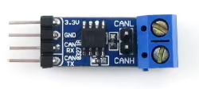

# ESP32 CAN Logger for CANaerospace with WiFi File Browser

This project implements a **dual-mode ESP32 application** for capturing and storing CAN bus data onto an SD card, \
while also providing a temporary WiFi access point with a web-based file browser to retrieve logged data.


---

## Features

### WiFi File Browser
- **WiFi SoftAP Setup** with WPA/WPA2 authentication.
- **Dynamic SSID Generation** based on ESP32 MAC address.
- **Web-based File Browser**:
  - Displays SD card files in a clean HTML table.
  - Supports file size display in human-readable format (KB, MB, GB).
  - Click-to-download functionality with MIME type detection.
- **Automatic Session Timeout**
  - Tracks last HTTP activity.
  - Shuts down after configurable inactivity time.
---

### CAN Logging System
- **CAN Bus Support (TWAI Driver)**
  - Configured for **500 kbit/s**.
  - Accepts all CAN frames.
  - Reliable driver startup with retry on failure.
- **SD Card Logging**
  - Files named sequentially as `CANxxxxx.LOG`.
  - Automatic **old file cleanup** if free space < 2 GB (reclaims up to 4 GB).
  - Efficient batch writes with **32 KB buffering**.
  - Uses `fsync()` to ensure data integrity.
- **Logging Format**
  - Each CAN frame stored as:
    ```
    (timestamp) can <ID>#<DATA>
    ```  
    Example:
    ```
    (1755839938.123456) can 123#11AAFF
    ```
- **Task-based Architecture**
  - `CAN_RX Task`: Receives frames from TWAI driver.
  - `CAN_Proc Task`: Formats messages into log lines.
  - `SD_Writer Task`: Buffers and writes batches to SD card.
- **Runtime Monitoring**
  - Tracks total message count.
  - Periodic logging of statistics to console.

---

## Technical Highlights
- **FreeRTOS Queues** for decoupled CAN reception and SD writing.
- **High-throughput SD logging** using buffered I/O.
- **Failsafe Storage Management** with automatic cleanup.
- **Lightweight Web Server** (ESP-IDF HTTPD) for SD browsing and downloads.
- **No RTC dependency**: Uses a fictional start timestamp to emulate Unix time.
- **Tested on an ESP32-S3 board:** [ESP32-S3 1.64inch AMOLED Touch Display Development Board](https://www.waveshare.com/esp32-s3-touch-amoled-1.64.htm) with a SANDISK Ultra \
  64 GB, microSDXC, U1, UHS-I.
- **Performance Test**: Running `cangen can0 -D i -I i -L 4 -g 0.5` resulted in a transmission rate of \
approximately 1,800 messages per second.
- **Power consumption**: Web server: 473 mW; Logger with display on: 420 mW; Logger with display off: 440 mW.
---

## Typical Use Case
1. **Power up device** → ESP32 starts in **WiFi AP mode** with SD card accessible via browser.
2. **Download / inspect past CAN logs** through the web interface.
3. **After inactivity timeout** → Device switches into **logging mode**, continuously recording
4. CAN traffic onto the SD card.

---

## Pin-to-Pin Wiring Table

| ESP32 Pin | Function       | Connected To                | Notes                        |
|-----------|----------------|-----------------------------|------------------------------|
| GPIO1     | SPI MOSI       | SD Card MOSI                | Data out from ESP32 → SD     |
| GPIO3     | SPI MISO       | SD Card MISO                | Data in from SD → ESP32      |
| GPIO2     | SPI SCLK       | SD Card SCLK                | SPI clock                    |
| GPIO41    | SPI CS         | SD Card CS                  | Chip select                  |
| GPIO9     | CS             | LCD Chip Select             | Active low                   |
| GPIO10    | PCLK           | LCD SPI Clock / Pixel Clock | QSPI clock                   |
| GPIO11    | DATA0          | LCD Data 0 (D0)             | QSPI data line               |
| GPIO12    | DATA1          | LCD Data 1 (D1)             | QSPI data line               |
| GPIO13    | DATA2          | LCD Data 2 (D2)             | QSPI data line               |
| GPIO14    | DATA3          | LCD Data 3 (D3)             | QSPI data line               |
| GPIO21    | RST            | LCD Reset                   | Optional, active low         
| GPIO18    | CAN TX         | CAN Transceiver TXD         | Transmit to CAN bus          |
| GPIO17    | CAN RX         | CAN Transceiver RXD         | Receive from CAN bus         |
| 3V3       | Power          | SD Card VCC, CAN VCC        | Ensure 3.3V compatible       |
| GND       | Ground         | SD Card GND, CAN GND        | Common ground reference      |
| CANH/—    | —              | CAN Bus High Line           | Differential bus line        |
| CANL/—    | —              | CAN Bus Low Line            | Differential bus line        |

## Recommended Parts List

### Core Components
- **ESP32 Development Board**
  - Example: ESP32-DevKitC, ESP32-WROOM, or M5Stack Core (if display/UI desired)
  - Must expose SPI pins and GPIOs used in the project

- **SD Card Module (SPI interface)**
  - Example: MicroSD Card Module (3.3V logic, SPI mode support)
  - Ensure 3.3V compatible (no 5V modules without level shifting)
  - MicroSD card, Class 10, A1 or higher, ≥16 GB recommended

- **CAN Transceiver** (connects ESP32 to CAN bus)
  - Example ICs:
    - SN65HVD230 (3.3V, commonly used with ESP32)
    - MCP2551 (5V, requires level shifting for ESP32)
    - TJA1050 (5V, also requires level shifting)
  - Choose based on bus voltage (3.3V-friendly parts are easier)

### Power & Connectivity
- **Stable 5V Supply** (for ESP32 board)
  - ESP32 boards usually regulate down to 3.3V internally
- **Common Ground Reference** between ESP32, SD card, and CAN transceiver
- **CAN Bus Wiring**
  - Twisted pair cable (for CANH & CANL)
  - 120 Ω termination resistors at both bus ends

### Optional / Helpful
- **MicroSD Card Reader** (for PC, to inspect logs directly if needed)
- **USB-to-CAN Adapter** (for testing/logging against a PC CAN interface)
- **Case/Enclosure** to protect the ESP32 + modules in automotive environment
- **For CANaerospace logs**: use [this program](https://github.com/ubx/canlog-correct-ts/blob/master/correct-ts.py) to adjust timestamps.
- **Format SD card**: use [this tool](https://www.sdcard.org/downloads/sd-memory-card-formatter-for-linux/)

### Bill of materials

| Number | Part                                                          | Qty | Picture                                          | 	Source                                                                                                                                                        |
|--------|---------------------------------------------------------------|-----|--------------------------------------------------|----------------------------------------------------------------------------------------------------------------------------------------------------------------|
| 1      | ESP32-S3 1.64inch AMOLED<br/> Touch Display Development Board | 1   |   | [AMOLED Touch Display<br/>Development Board](https://www.waveshare.com/esp32-s3-touch-amoled-1.64.htm)                                                         |                                                                                
| 2      | SN65HVD230 CAN Board                                          | 1   |         | [SN65HVD230 CAN Board	](https://www.waveshare.com/sn65hvd230-can-board.htm)                                                                                    |                                                                                      |
| 3      | Step Down Converter Modul                                     | 1   |         | [Step Down Converter Modul	](https://de.aliexpress.com/item/1005006461126809.html?spm=a2g0o.order_list.order_list_main.76.1a475c5fBDXy9Z&gatewayAdapt=glo2deu) |
| 4      | M12 5 Pin Cable Connector                                     | 1   |  | [M12 5 Pin Cable Connector](https://de.aliexpress.com/item/1005008983446794.html?spm=a2g0o.order_list.order_list_main.60.1a475c5fBDXy9Z&gatewayAdapt=glo2deu)  |
| 5      | micro sd card                                                 | 1   |                      |
| 6      | M2x5 round screw                                              | 4   |                                                  |                                                                                                                                                                |
| 7      | M2.5x5 countersunk screw                                      | 1   |
| 8      | M2.5x4 insert                                                 | 1   |
| 9      | Optional:<br/>SD-TF-extension-cable                           | 1   |        | [SD-TF-extension-cable	](https://de.aliexpress.com/item/1005005671622003.html?spm=a2g0o.order_list.order_list_main.4.3fb05c5fkolpFm&gatewayAdapt=glo2deu)      |


---

## Troubleshooting: sdQueue full / canQueue full warnings
If you see warnings like:
- W (xxxx) CAN_Proc: sdQueue full, dropped line
- W (xxxx) CAN_RX: canQueue full, dropped

it means the producer tasks (CAN reception/formatting) are temporarily faster than the consumer (SD writer). \
The firmware includes several mitigations:

Additional steps you can take
- Use a fast SD card (A1/A2 or High Endurance) and keep it healthy/formatted (FAT32).
- Reduce other workload while logging (disable unnecessary peripherals, WiFi, or display if not needed).
- If you still experience drops, you can increase queue depths in src/logger/logging.cpp:
  - CAN_QUEUE_LEN: number of CAN frames buffered between driver and formatter.
  - SD_QUEUE_LEN: number of formatted lines buffered before SD writing.
    Be mindful that increasing these consumes internal RAM.
- If your board has PSRAM, keep it enabled. The logger uses a large batch buffer to write in big chunks for higher throughput.
- Ensure stable 3.3 V supply. Brownouts can slow peripherals and the filesystem.

Notes
- Even with a high-rate CAN traffic (e.g., ~1200 msgs/s), a proper SD card and power supply should avoid drops in most cases.
- If absolute losslessness is required, consider reducing CAN bus load, increasing queue sizes, or writing in binary \
to reduce per-message overhead.

## Todo
- Optional: PCB